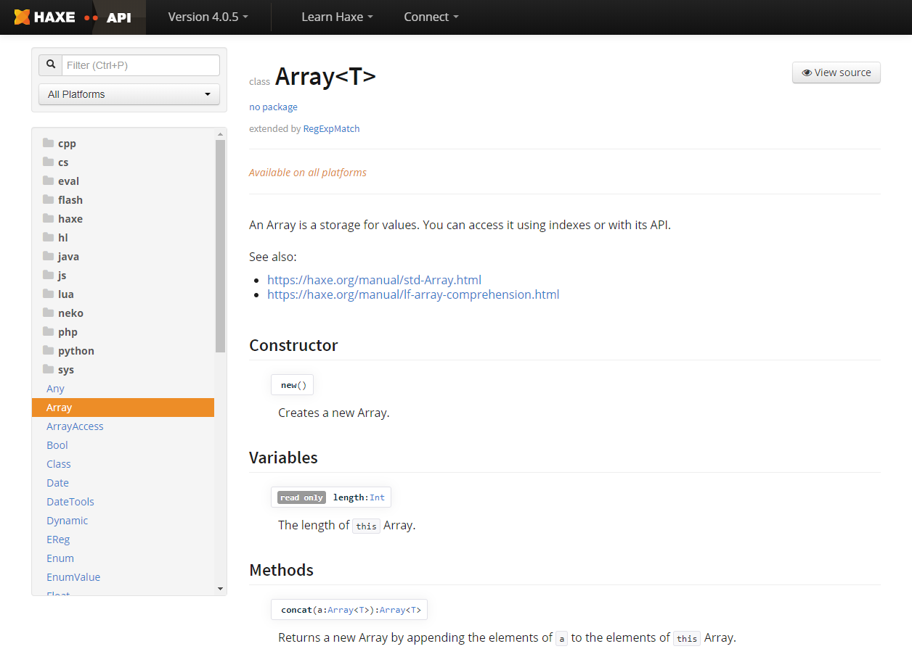

# Dox
[](https://github.com/HaxeFoundation/dox/actions?query=workflow%3ACI)
[](https://lib.haxe.org/p/dox)
[](https://lib.haxe.org/p/dox)
[](LICENSE.md)


A Haxe documentation generator used by many popular projects such as:

- [Haxe](https://api.haxe.org/)
- [OpenFL](https://api.openfl.org/)
- [HaxeFlixel](http://api.haxeflixel.com/)
- [Heaps](https://heaps.io/api/)
- [HaxePunk](http://haxepunk.com/documentation/api/)
- [Kha](http://api.kha.tech/)



### Installation

Install the library via [haxelib](http://lib.haxe.org/p/dox):
```
haxelib install dox
```

### Usage

> **Note:** Dox requires Haxe 3.1 or higher due to some minor changes in
abstract rtti xml generation. You'll also need an up-to-date haxelib
(requires support for `classPath` in _haxelib.json_)

1. Compile all relevant code with Haxe using `haxe -xml docs/doc.xml -D doc-gen`.
2. Invoke `haxelib run dox -i docs`, where dir points to the .xml file(s) generated by step 1.

**:clipboard: For more details, custom theme creation and options [check out the Dox wiki](https://github.com/HaxeFoundation/dox/wiki/)**

### Local development

To test Dox locally, clone the git, run `npm install` in root of directory. This installs the correct Haxe version using Lix and installs the required dependencies.

After that you can run:
```
npx haxe --run Make dox xml pages server
```
This compiles Dox, creates xml's, generates the pages and starts a local dev server at <http://localhost:2000>.
